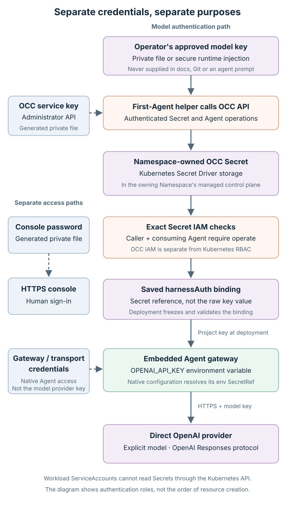

# OpenClaw Enterprise: detailed local runbook

**Execute the preflight in Section 2, then follow the sections in order.** Use the [human guide](GETTING_STARTED.md) for the five-step overview.

Updated October 7, 2026. New exploration starts from current upstream `main`; record its resolved SHA for each installation. A fresh CSB Mac run at `8023db20d5a7cfa84dbfe734d43898fc8cc354ce` passed official startup/network/native sandbox checks, PostgreSQL readiness, HTTPS administrator sign-in and a genuine embedded GPT-6 Luna gateway nonce/arithmetic response with maximum effort configured. The console showed the matching Agent/revision and successful deployment; its persisted status alone did not establish live serving. The separate model check did. Tools were not exercised, effort wire data was not captured and billing was not measured. Browser access used an operator-approved exact local certificate exception; no CA import/system trust change is claimed. The October 1 embedded hosted-GLM tool task remains historical evidence on older source. Sensitive receipts are not published. Qualify each new installation independently.

## 1. Select the development profile

```text
Apple Silicon Mac → isolated Colima Linux VM → Docker → k3d/K3s
  → PostgreSQL + OCE API/worker + Envoy Gateway/cert-manager → Agent Pods
```

OCE means **OpenClaw Enterprise**; OCC means **OpenClaw Control Plane**. The Mac runs the platform and tools; provider models run remotely.

[](assets/architecture.svg)

Click any diagram to open its full-size SVG; the text remains the executable reference.

| Input | October 1 historical working selection |
| --- | --- |
| OCE source | `affac2bfc1370e590e6da570bcaaad4a207c9f09` |
| Runtime OpenClaw source, selected by its Dockerfile | `9d9c8568c51e340540f634f71bd7c7582a70debc` |
| Runtime Codex engine | `0.158.0` |
| Toolchain | Node >=24; pnpm `11.15.1`; Go `1.27` (observed `1.27.1`) |
| Kubernetes | k3d `5.9.0`; K3s `v1.36.4+k3s1`; containerd `2.3.4`; kubectl `1.36.4` |
| Container tools | Docker daemon `29.5.2`; Docker CLI `29.8.1` |
| Dedicated VM | Colima VZ/aarch64; 6 CPUs; 14 GiB RAM; 45 GiB sparse disk |
| Observed guest | Ubuntu `24.04.4`; kernel `6.8.0-117-generic` |
| Platform dependencies | PostgreSQL `18.6`; cert-manager `1.18.4`; Envoy Gateway `1.6.7` |

Select Kubernetes compute and control plane with **`Sandbox Driver=none`**. This profile does not install or qualify OpenShell enforcement/credential brokering. Native Codex workspace sandboxing is a separate boundary. Default startup selects a Compose preview that cannot deploy Agents; the Compose/Kubernetes hybrid also differs from this recipe.

The table records history, not mandatory install versions. Prefer current `main` while OCE is changing quickly: older commits can miss startup and database fixes. Record the new SHA, derive its toolchain from `package.json`/`go.mod`, and hold that checkout fixed throughout one installation. Recheck [current upstream setup](https://github.com/openclaw/openclaw-enterprise/blob/main/docs/guides/quickstart.md) if `main` advances beyond the [reviewed profile contract](https://github.com/openclaw/openclaw-enterprise/blob/8023db20d5a7cfa84dbfe734d43898fc8cc354ce/docs/guides/deploy/local-kubernetes-development.md). Pinned links below identify reviewed evidence; clone commands do not pin the historical SHA. Kubernetes-only startup selects its own K3s image; do not independently choose a K3s channel from another profile.

### Company-managed/CSB boundary

Use the organization's approved VM/runtime, network egress, model gateway and credential handling. Preserve endpoint protection, host security policy, VPN/DNS and unrelated services. Security alerts or terminated workloads need the organization's approved resolution; do not disable an endpoint sensor or change the Mac's protection settings. Loopback publication and an owned VM do not establish compliance approval.

The conditional guest sysctl in Section 9 changes a Linux VM's policy. Apply it only if the cause is established and the organization permits that prerequisite. Otherwise use an approved compatible development VM or remote environment and report the local blocker. Do not install experimental OpenShell components merely to work around a failed Kubernetes-only startup.

## 2. Prepare the tools and source

### Agent-led setup entry point

If an operator asks your coding agent to install OCE, read [setup.md](https://redhat-et.github.io/openclaw-enterprise-onboarding/setup.md) and continue this runbook in order. The [llms.txt index](https://redhat-et.github.io/openclaw-enterprise-onboarding/llms.txt) discovers the files; [llms-full.txt](https://redhat-et.github.io/openclaw-enterprise-onboarding/llms-full.txt) combines the brief and runbook for one fetch. These files guide execution; they do not execute on retrieval. Use terminal-capable Claude Code, Codex, Cursor or an equivalent agent.

Read the [preflight script](https://redhat-et.github.io/openclaw-enterprise-onboarding/setup-check.sh) before running it. From this onboarding repository use `bash scripts/check-setup.sh`. It inventories host/tools, storage, ports and existing runtime profiles without installing or reading credentials. After cloning, add `--source '<OCE checkout>'` to check manifest requirements. It defaults to `--engine docker`; add `--docker-host 'unix://<owned host socket>'` only for the deliberately selected local Docker daemon. Add `--require-colima` when choosing a new Colima profile; an existing Lima/Docker or Docker Desktop environment does not require Colima. For the Podman alternative use `--engine podman`; its CLI/machine inventory does not prove rootful mode, cgroups, host socket or daemon acceptance. The script changes no context and creates no VM/cluster.

[](assets/setup-flow.svg)

Install Git, Bash, Python 3 for the preflight, the checkout's Node/pnpm/Go versions, k3d, kubectl and Helm. Use native arm64 tools on Apple Silicon. The October 7 reviewed checkout requires Node >=24, pnpm `11.15.1` and Go >=`1.27`; verify these manifests again rather than assuming they remain current. For Docker, the CLI must support `docker image save --platform` and expose its Buildx plugin through `docker buildx version`. Kubernetes-only startup does not need Docker Compose. A standalone `docker-buildx version` does not establish that Docker can find the plugin.

Check the **executable actually selected by `PATH`**, not just an installed package. For example, an approved Homebrew `node@24` installation can coexist with a stale default `node` symlink; in that case add its `bin` directory to this shell's `PATH` and rerun `node --version`. Do not replace global symlinks or install another toolchain before inspecting the existing one.

Plan **45–90 minutes**, including first downloads, builds and Agent startup; this is an estimate. The October 7 working VM allocation is **6 CPUs / 14 GiB RAM / 60 GiB disk**; these are not minimums. The table retains the older 45 GiB disk as historical evidence. A 4 GiB engine allocation failed the runtime build. Separately allow roughly **60 GiB free host storage** for build headroom. At the reviewed revision an Agent Gateway requests `1792Mi` and has a `3Gi` limit; a dedicated Codex Harness adds a `768Mi` request and `6Gi` limit. Check [current sizing](https://github.com/openclaw/openclaw-enterprise/blob/main/docs/guides/deploy/installation-profiles.md) before creating more Agents.

Inspect installed tool versions, Colima/Lima/Podman profiles, Docker contexts and ports **3300, 8444, 6444**. Choose distinct names/ports if occupied. Preserve existing default Docker/kubectl contexts and unrelated services. Do not auto-start every discovered runtime or auto-switch an existing Podman machine's mode.

### Clone current source

Run in Bash; choose an unused work directory. Private state will live beside, outside, the source checkout.

```bash
set -euo pipefail
umask 077
export OCE_WORK="$HOME/oce-onboarding-dev"
mkdir -p "$OCE_WORK"
git clone --branch main --single-branch https://github.com/openclaw/openclaw-enterprise.git \
  "$OCE_WORK/openclaw-enterprise"
cd "$OCE_WORK/openclaw-enterprise"
git rev-parse HEAD
git status --short
node --input-type=module <<'NODE'
import { readFileSync } from 'node:fs';
const manifest = JSON.parse(readFileSync('package.json', 'utf8'));
console.log('Node:', manifest.engines.node);
console.log('pnpm:', manifest.packageManager);
console.log(readFileSync('go.mod', 'utf8').match(/^go\s+\S+/m)?.[0]);
NODE
node --version
pnpm --version
go version
```

Require clean source and tool versions compatible with the printed manifests. Record `git rev-parse HEAD` in the private receipt before installation. Read the checkout's `AGENTS.md` before source changes. This guide requires none. Use the declared pnpm version; do not edit the lockfile to fix a host toolchain failure. For an existing clean exploration checkout, update deliberately with `git pull --ff-only` before a fresh installation, then record the new SHA. Never pull or rebuild midway through a running installation and treat it as an upgrade.

Use an existing matching package manager when available. If the declared pnpm needs an approved installation, this keeps it in the task's private tool prefix and preserves the global pnpm:

```bash
export OCE_PACKAGE_MANAGER="$(node -p 'require("./package.json").packageManager.split("+")[0]')"
case "$OCE_PACKAGE_MANAGER" in pnpm@*) ;; *) exit 1 ;; esac
mkdir -p "$OCE_WORK/private"
chmod 700 "$OCE_WORK/private"
npm install --prefix "$OCE_WORK/private/tools" --no-audit --no-fund \
  "$OCE_PACKAGE_MANAGER"
export PATH="$OCE_WORK/private/tools/node_modules/.bin:$PATH"
```

An npm local prefix exposes its executable in **`node_modules/.bin`**, not `tools/bin`. A global pnpm can auto-download/switch versions for a project, masking which executable was selected. Verify without implicit package-manager downloads, then install the frozen dependencies and build:

```bash
export npm_config_manage_package_manager_versions=false
export COREPACK_ENABLE_AUTO_PIN=0
export COREPACK_ENABLE_NETWORK=0
export OCE_PNPM_VERSION="$(node -p 'require("./package.json").packageManager.split("+")[0].slice("pnpm@".length)')"
test "$(pnpm --version)" = "$OCE_PNPM_VERSION"
pnpm install --frozen-lockfile
pnpm cli:build
```

## 3. Choose the VM and container engine

| Layer | Purpose and choice |
| --- | --- |
| Linux VM on macOS | Colima manages a Lima VM and supplies a host Docker socket. Existing approved Lima/Docker or Docker Desktop environments can supply the same layer; inspect architecture, resources, mounts and ownership first. |
| Container engine | Docker is this guide's historical working Mac path. Upstream also supports rootful Podman; a company preference for Podman does not make it interchangeable without its prerequisites. |
| k3d | Creates owned K3s node containers in the selected engine. It is not the Linux VM or the container engine. Let the OCE launcher create its cluster. |
| K3s | Kubernetes inside those node containers. Do not enable Colima Kubernetes or attach this development launcher to an unrelated cluster. |

Reuse an approved existing engine only if it has enough free resources and permits this development workload. Give OCE distinct cluster/state/ports, even when the engine is shared. Do not stop or reconfigure a shared VM to repair OCE. A new owned Colima profile is the documented isolation choice when no suitable runtime exists.

### New owned Colima profile

```bash
export OCE_PROFILE='oce-onboarding'
colima --profile "$OCE_PROFILE" start \
  --arch aarch64 --vm-type vz --runtime docker \
  --cpus 6 --memory 14 --disk 60 \
  --activate=false --ssh-config=false

unset DOCKER_CONTEXT DOCKER_TLS_VERIFY DOCKER_CERT_PATH DOCKER_HOST
export DOCKER_HOST="unix://$HOME/.colima/$OCE_PROFILE/docker.sock"
docker version
docker info --format '{{.OSType}}/{{.Architecture}}; memory={{.MemTotal}}'
docker buildx version
docker image save --help
export OCE_DOCKER_ROOT="$(docker info --format '{{.DockerRootDir}}')"
colima --profile "$OCE_PROFILE" ssh -- df -h / "$OCE_DOCKER_ROOT"
```

Require the selected daemon to respond, Buildx to be a Docker CLI command, and `image save` help to list `--platform`. The socket assumes Colima's default home; customized `COLIMA_HOME` requires its actual host-reachable socket. Do not copy a guest-only socket path. `--activate=false --ssh-config=false` preserves default context/SSH settings. These exports affect only this shell; do not run `docker context use` or `kubectl config use-context`.

### Existing Docker engine

Inspect `docker context ls` and the intended context's **non-secret** endpoint, or your VM manager's documented socket. Select its actual host-reachable local Unix socket:

```bash
unset DOCKER_CONTEXT DOCKER_TLS_VERIFY DOCKER_CERT_PATH DOCKER_HOST
export DOCKER_HOST='unix://<approved existing host socket>'
docker version
docker info --format '{{.OSType}}/{{.Architecture}}; memory={{.MemTotal}}'
docker buildx version
docker image save --help
```

Replace the socket placeholder before running. Keep using that explicit endpoint in every OCE/k3d lifecycle shell. Check `docker info --format '{{.DockerRootDir}}'` and inspect that **guest path's backing filesystem** using the selected VM manager. For example, run `colima --profile '<existing-profile>' ssh -- df -h / '<DockerRootDir>'` or `limactl shell '<existing-instance>' df -h / '<DockerRootDir>'`. Colima can mount a separate Docker data disk: checking only `/var` can report the smaller guest root disk and miss the actual image-storage capacity. Reuse does not qualify a different kernel/runtime automatically.

### Podman alternative

Follow [upstream rootful Podman requirements](https://github.com/openclaw/openclaw-enterprise/blob/8023db20d5a7cfa84dbfe734d43898fc8cc354ce/docs/guides/deploy/local-kubernetes-development.md#start-the-profile). Native rootless Podman cannot start this profile because K3s needs the `cpuset` controller. Use an approved **rootful** machine as the normal macOS user; never run host `sudo podman` to approximate this. Rootful/rootless storage is separate, so changing an existing machine affects its environment.

Select its recorded host connection and set `OCC_DEVELOPMENT_CONTAINER_ENGINE=podman` instead of the Docker value in Section 4. Let upstream resolve the machine's host API socket; `podman info` can report a guest-only path, which is invalid as host `DOCKER_HOST`/`CONTAINER_HOST`. Retain the connection and any approved `CONTAINERS_CONF_OVERRIDE` for cleanup. This companion guide's historical Mac acceptance used Docker; independently verify the Podman path. Do not uninstall Podman or change organizational runtime policy to use these docs.

Intel Mac, standalone Lima, Docker Desktop, Podman and Linux variants are not qualified by the historical reproduction.

## 4. Install the Kubernetes profile

Create only the private parent. **The state directory itself must be absent** for fresh startup. Cluster names must start with `occ-dev-`.

```bash
mkdir -p "$OCE_WORK/private"
chmod 700 "$OCE_WORK/private"
export OCC_DEVELOPMENT_STATE_DIRECTORY="$OCE_WORK/private/onboarding-state"
export OCC_DEVELOPMENT_KUBERNETES_CLUSTER='occ-dev-oce-onboarding'
export OCC_DEVELOPMENT_COMPUTE_DRIVER=kubernetes
export OCC_DEVELOPMENT_CONTROL_PLANE=kubernetes
export OCC_DEVELOPMENT_SANDBOX_DRIVER=none
export OCC_DEVELOPMENT_CONTAINER_ENGINE=docker
export OCC_DEVELOPMENT_KUBERNETES_NAMESPACE=oce-system
export OPENCLAW_DEV_PORT=3300
export OCC_DEVELOPMENT_BROWSER_PORT=8444
export OCC_DEVELOPMENT_KUBERNETES_API_PORT=6444
export OCC_DEVELOPMENT_STARTUP_TIMEOUT_SECONDS=600
unset OCC_DEVELOPMENT_CONTROLLER_IMAGE OCC_KUBERNETES_RUNTIME_IMAGE
./bin/occ dev up
```

Require **`OpenClaw Enterprise development stack is ready.`** The launcher builds/imports matched source images, installs the platform and generates private state. It performs NetworkPolicy acceptance and checks the dedicated Codex sandbox against the imported runtime before declaring success.

The source build avoids assuming published registry access. For an intentional published-image alternative, follow [current upstream image selection](https://github.com/openclaw/openclaw-enterprise/blob/main/docs/guides/deploy/published-images.md): select controller/runtime together, match the source revision labels to the checkout and record immutable digests. A `latest` image pair can select a different source revision from current `main`; do not mix them. Local build digests are not promised as downloadable images.

Keep passwords, service keys, kubeconfig and TLS private keys private. Do not publish state/Helm values/Installation YAML, full Secret objects, Pod environments or native auth files. The state directory is `0700`; keep it outside Git. A startup failure may roll back the owned cluster; use the printed cleanup instruction for retained failed state, then resolve the cause before retrying.

## 5. Check readiness and sign in

PostgreSQL holds OCE's platform state, including IAM grants and resource/revision records. The official launcher provisions it inside the owned k3d cluster. Verify that database before creating an Agent or diagnosing a first-Agent IAM error.

```bash
export OCC_URL="http://127.0.0.1:$OPENCLAW_DEV_PORT"
export OCC_SERVICE_KEY_FILE="$OCC_DEVELOPMENT_STATE_DIRECTORY/initial-admin-service-key.json"
export OCE_KUBECONFIG="$OCC_DEVELOPMENT_STATE_DIRECTORY/kubeconfig"
export OCE_CONTEXT="k3d-$OCC_DEVELOPMENT_KUBERNETES_CLUSTER"
export OCE_PLATFORM_NAMESPACE="$OCC_DEVELOPMENT_KUBERNETES_NAMESPACE"
./bin/occ installation get
./bin/occ namespace list
curl --fail --max-time 10 "$OCC_URL/readyz"
kubectl --kubeconfig "$OCE_KUBECONFIG" --context "$OCE_CONTEXT" get pods -A
kubectl --kubeconfig "$OCE_KUBECONFIG" --context "$OCE_CONTEXT" \
  -n "$OCE_PLATFORM_NAMESPACE" get statefulset/postgres pvc/postgres-data
kubectl --kubeconfig "$OCE_KUBECONFIG" --context "$OCE_CONTEXT" \
  -n "$OCE_PLATFORM_NAMESPACE" rollout status statefulset/postgres --timeout=120s
kubectl --kubeconfig "$OCE_KUBECONFIG" --context "$OCE_CONTEXT" \
  -n "$OCE_PLATFORM_NAMESPACE" exec statefulset/postgres -c postgres -- \
  pg_isready -U postgres -d openclaw_enterprise
kubectl --kubeconfig "$OCE_KUBECONFIG" --context "$OCE_CONTEXT" \
  -n "$OCE_PLATFORM_NAMESPACE" exec statefulset/postgres -c postgres -- \
  psql -X -v ON_ERROR_STOP=1 -U postgres -d openclaw_enterprise -Atc 'SELECT 1;'
```

Require authenticated Installation access, platform Namespace `default` status `ready`, `/readyz` HTTP 200 and Ready platform Pods. Also require PostgreSQL `1/1` Ready, PVC `postgres-data` `Bound`, `pg_isready` accepting connections and the query returning `1`. PostgreSQL is a StatefulSet, not a Deployment; current first-Agent IAM/Secret checks execute against `statefulset/postgres`. The platform Namespace is distinct from Kubernetes' built-in `default` namespace. Retain its returned `ns_...` ID privately; do not invent IDs.

Open the printed **Browser console** URL. With these examples it is:

```text
https://console.occ-dev-oce-onboarding.oce.localhost:8444/console/
```

Follow [upstream browser trust instructions](https://github.com/openclaw/openclaw-enterprise/blob/8023db20d5a7cfa84dbfe734d43898fc8cc354ce/docs/guides/quickstart.md#open-the-platform-console) for the printed public `browser-ca.crt`, using an organization-approved browser trust method on CSB. Import only that certificate if your method permits it, never private keys or the state directory; remove imported trust when discarding the installation. An approved exact-site development exception is another operator choice after checking the local certificate chain and hostname. The October 7 browser sign-in used that verified local exception; it did not import a CA or change system trust. Do not disable certificate verification globally. If neither method is permitted, record the browser-trust blocker.

For this profile's printed hostname, an explicit-CA check keeps trust scoped to one request and verifies the hostname against the local certificate:

```bash
export OCE_BROWSER_HOST="console.$OCC_DEVELOPMENT_KUBERNETES_CLUSTER.oce.localhost"
curl --fail --max-time 10 --output /dev/null --write-out '%{http_code}\n' \
  --cacert "$OCC_DEVELOPMENT_STATE_DIRECTORY/browser-ca.crt" \
  --resolve "$OCE_BROWSER_HOST:$OCC_DEVELOPMENT_BROWSER_PORT:127.0.0.1" \
  "https://$OCE_BROWSER_HOST:$OCC_DEVELOPMENT_BROWSER_PORT/console/"
```

Require HTTP `200`, then handle any browser-owned trust prompt through the approved local method. This check does not import trust or sign in; verify actual HTTPS password login and access to the intended Namespace in the browser.

Sign in as `admin@development.openclaw.invalid` using the generated **Administrator password file**, ordinarily `initial-admin-password` in private state. Read it locally without logged output. Password login uses HTTPS; port 3300 is the separate service-key API. HTTP password sign-in can correctly fail with origin/CSRF 403; do not weaken that policy.

## 6. Deploy the upstream first Agent

[](assets/credential-flow.svg)

The model key, administrator service key, HTTPS console password and native Agent transport credential have distinct purposes. The diagram follows the direct OpenAI starter; optional hosted GLM uses its separately configured Anthropic-compatible provider and model Secret.

Use a valid **direct OpenAI credential** and explicitly select an available, budget-approved model by its plain ID. This is [upstream's documented prompt-only workflow](https://github.com/openclaw/openclaw-enterprise/blob/8023db20d5a7cfa84dbfe734d43898fc8cc354ce/docs/guides/first-agent.md), not the historical hosted-GLM task used locally. The reviewed helper fixes the provider URL to `https://api.openai.com/v1` and its API to `openai-responses`; it has no gateway URL or reasoning-effort option.

```bash
export OPENCLAW_FIRST_AGENT_MODEL='<approved direct OpenAI model ID>'
node scripts/first-agent.mjs onboarding-agent --prompt 'What is 2 + 2?'
```

Replace the placeholder first. The helper privately prompts if no key is supplied. For automation, use `OPENAI_API_KEY_FILE` pointing to a protected private file, or approved environment injection through `OPENAI_API_KEY`; supplying both fails. Never put a key in the command, Configuration JSON or chat. A stale exported key is used as is. This helper does not turn an arbitrary gateway credential into a direct OpenAI credential.

Inspect only named variables and redacted settings when routing differs from your selection; never dump the entire environment or a credential-bearing client configuration. The coding agent's own provider settings are separate from the deployed OCE Agent's native Configuration. For example, a stale `CLAUDE_CODE_USE_VERTEX` in a Claude Code client can affect that client's routing; it does not configure OCE. Confirm which selected key input is present without printing its value:

```bash
node --input-type=module <<'NODE'
for (const name of ['OPENAI_API_KEY', 'OPENAI_API_KEY_FILE',
  'OPENCLAW_FIRST_AGENT_MODEL', 'CLAUDE_CODE_USE_VERTEX']) {
  console.log(`${name}: ${process.env[name] ? 'set' : 'unset'}`);
}
NODE
```

The helper creates the Secret and embedded Agent, grants Secret access, prepares transport, deploys and verifies a model turn. Keep it running until **`Model response verified:`** and **`Agent response:`** appear; record the returned active revision. Initial startup may take several minutes. Use the HTTPS console origin printed by setup; the helper's API-origin console link does not replace the password-login HTTPS origin. Verify the same Agent and revision in the console. It remains after the helper exits.

Tools/native admin UI are disabled by this starter. A prompt response does not prove filesystem tools. Rerun the same helper-created Agent name for further prompts; use a new name for a console-created Agent. Follow upstream's replacement-key procedure if authentication fails.

### Approved gateway models

An OpenAI-family model behind an AI gateway is a separate provider configuration. The model name does not establish the gateway's API or authentication compatibility. Before sending a key or inference request, establish these approved inputs:

| Input | Check |
| --- | --- |
| Endpoint and protocol | Exact HTTPS base URL and supported native API: `openai-responses`, `openai-completions` (chat completions) or `anthropic-messages`. A gateway can support only a subset. Preserve a required URL prefix. |
| Authentication | The gateway's bearer-key or `x-api-key` contract, represented by a runtime-supported provider/Secret reference. Do not send a gateway key to direct OpenAI or assume the Anthropic provider means the model is Claude. |
| Model identifier | Exact gateway catalog ID, including any slash-separated routing parts; compare the saved native Configuration with the intended provider/model reference. The direct helper rejects such IDs. |
| Reasoning effort | The selected model, gateway and pinned runtime must all support the requested effort and its configuration/wire mapping. Model selection alone does not set maximum effort. Record the supported setting; do not claim an effort that was not configured. |
| Authorization and cost | Protected local key file or approved injection, permitted task data, explicit model/budget and bounded verification calls. Startup itself performs a model probe. |

Create a **separate console/API-managed Agent**, following [native Configuration](https://github.com/openclaw/openclaw-enterprise/blob/8023db20d5a7cfa84dbfe734d43898fc8cc354ce/docs/reference/configuration.md) and [Secret/IAM deployment](https://github.com/openclaw/openclaw-enterprise/blob/8023db20d5a7cfa84dbfe734d43898fc8cc354ce/docs/guides/deploy/production-agents.md#grant-the-agent-access-to-its-model-secret). Save the gateway key in a Namespace Secret, use a `harnessAuth` Secret binding and native provider `apiKey` SecretRef, and grant the exact Agent `operate` on that Secret. Keep the URL/model/API configuration non-secret; never inline a key in Advanced settings. Do not mutate the helper-managed Agent, whose saved Configuration is deliberately checked on reuse.

Deploy the saved revision, require its native startup probe to pass, then verify an authenticated model response and matching active revision as in Section 7. Preserve bounded startup checks; a catalog response or successful direct gateway request alone does not qualify OCE routing. A custom endpoint, multi-part model ID, alternate authentication or dedicated Codex adapter needs fresh verification. This public guide supplies no company gateway endpoint or credential.

Keep credential brokering/proxy configuration separate from model routing. Selecting an OpenShell credential gateway or reaching its proxy does not establish that the runtime supports a gateway model, protocol, multi-part ID or reasoning effort. Check the actual saved provider/model reference and deployed image's implementation before inference; avoid patching experimental OpenShell routing as an onboarding shortcut.

### OpenAI-compatible gateway configuration: GPT-6 Luna, maximum effort

This configuration selects `gpt-6-luna` through an approved OpenAI-Responses-compatible gateway using bearer API-key authentication. Its OCE/native reference is `openai/gpt-6-luna`; provider ID is `openai`, Harness is `openclaw`, and execution mode is `embedded`. The October 7 CSB run verified the exact frozen/active revision, one matching Ready gateway Pod, unauthenticated denial, a fresh nonce response and arithmetic result **437**, plus HTTPS sign-in and the same Agent/revision in the console. `thinkingDefault=max` and its mapping were preserved in that revision; wire-level effort was not independently captured. Tools were denied and not exercised. Use this only when your approved gateway advertises that exact model and supports Responses and `max` effort; a different gateway needs separate qualification.

Set the gateway's exact **HTTPS API base URL**, retaining its required path prefix (commonly ending in `/v1`), rather than its `/responses` request URL. This block writes a non-secret Configuration only; it creates no OCE resource and makes no model call:

```bash
export OCE_GATEWAY_BASE_URL='<approved OpenAI-compatible HTTPS API base URL>'
export OCE_CONFIGURATION_FILE="$OCE_WORK/private/embedded-openai-gateway.json"
node --input-type=module <<'NODE'
import { writeFileSync } from 'node:fs';
const destination = process.env.OCE_CONFIGURATION_FILE;
const url = new URL(process.env.OCE_GATEWAY_BASE_URL);
if (!destination || url.protocol !== 'https:' || url.username || url.password ||
    url.search || url.hash || /\/(?:responses|chat\/completions)\/?$/.test(url.pathname)) {
  throw new Error('Use an approved HTTPS API base URL and a private output path.');
}
const providerModelId = 'gpt-6-luna';
const model = `openai/${providerModelId}`;
const configuration = { kind: 'agent', values: {
  gateway: {
    mode: 'local', bind: 'lan', controlUi: { enabled: false },
    auth: { password: {
      source: 'env', provider: 'default', id: 'OPENCLAW_GATEWAY_PASSWORD',
    } },
    http: { endpoints: { chatCompletions: { enabled: true } } },
  },
  agents: { defaults: {
    model, skipBootstrap: true, thinkingDefault: 'max',
    models: { [model]: { agentRuntime: { id: 'openclaw' } } },
  } },
  tools: { deny: ['*'] },
  secrets: { providers: { model: {
    source: 'env', allowlist: ['OPENAI_API_KEY'],
  } } },
  models: { providers: { openai: {
    baseUrl: url.toString().replace(/\/$/, ''), api: 'openai-responses',
    apiKey: { source: 'env', provider: 'model', id: 'OPENAI_API_KEY' },
    models: [{ id: providerModelId, name: 'GPT-6 Luna', input: ['text'],
      reasoning: true, thinkingLevelMap: { max: 'max' },
      compat: {
        supportsReasoningEffort: true,
        supportedReasoningEfforts: ['none', 'low', 'medium', 'high', 'xhigh', 'max'],
        supportsTemperature: false,
      },
      contextWindow: 1050000, maxTokens: 2048 }],
  } } },
} };
writeFileSync(destination, JSON.stringify(configuration, null, 2) + '\n', {
  mode: 0o600, flag: 'wx',
});
console.log('Non-secret gateway configuration written; no resources or inference created.');
NODE
```

The explicit `thinkingDefault`, `thinkingLevelMap` and compatibility metadata map maximum thinking to Responses reasoning effort in the reviewed native runtime. Preserve this mapping in the saved and frozen revision. Confirm the gateway's current model limits before changing the declared metadata. Do not add a second `Authorization`/`x-api-key` header to this provider: its `apiKey` SecretRef supplies the bearer credential through the native SDK. This recipe does not describe an Anthropic-Messages gateway.

The fresh verification used an explicitly authorized bounded inference budget. That authorization is not metered billing evidence or a hard spending cap enforced by this recipe. Record your own approved budget and provider usage without publishing account details.

Complete the existing [console creation workflow](https://github.com/openclaw/openclaw-enterprise/blob/8023db20d5a7cfa84dbfe734d43898fc8cc354ce/docs/reference/console/create-and-deploy.md#create-an-agent):

1. In the Ready `default` platform Namespace, choose **Create Agent → Start without Preset → OpenAI → OpenClaw → Embedded**. Use a unique owned Agent name and **Enter model ID manually** with `gpt-6-luna`.
2. Choose an existing approved model Secret or create one from the protected **key-only** input through the approved credential workflow. A raw key file contains one token, with no Markdown backticks, prose or shell assignment. Keep it out of chat, logs and Advanced settings. API automation can read `<approved protected key file>` directly in process memory through the [documented Secret creation flow](https://github.com/openclaw/openclaw-enterprise/blob/8023db20d5a7cfa84dbfe734d43898fc8cc354ce/docs/reference/drivers/kubernetes-secret.md#create-a-namespace-owned-secret).
3. In **Advanced settings**, use the generated native **`values` object**; `kind` is OCC resource metadata. Confirm the model remains `openai/gpt-6-luna`, provider base URL/API and maximum-effort mapping are preserved, tools are denied, and the model key remains a Secret reference.
4. Save the Agent with `harnessAuth.method=api_key` and the exact Namespace-owned model Secret. The caller and Agent service principal both require **`operate` on that exact Secret**. Confirm credential access completed; if the console reports a grant failure, use **Retry credential access** or the [documented exact IAM grant](https://github.com/openclaw/openclaw-enterprise/blob/8023db20d5a7cfa84dbfe734d43898fc8cc354ce/docs/guides/deploy/production-agents.md#grant-the-agent-access-to-its-model-secret). Kubernetes RBAC does not replace that grant.
5. Choose **Deploy new version**; it prepares initial transport credentials and admits the saved Configuration. Require the exact deployment to succeed and the same revision to become active. Then perform Section 7's authenticated nonce/prompt check against that revision, recording model, protocol and the frozen maximum-effort configuration. This starter denies tools; a prompt response does not prove tool execution.

For CLI/API automation, reuse the upstream [Agent preparation, IAM and transport/deployment procedure](https://github.com/openclaw/openclaw-enterprise/blob/8023db20d5a7cfa84dbfe734d43898fc8cc354ce/docs/guides/deploy/production-agents.md#prepare-each-agent), with this generated Configuration, `AGENT_EXECUTION_MODE=embedded`, `HARNESS_AUTH_METHOD=api_key` and server-returned IDs from your local Ready Namespace. The complete sequence is **Secret → Configuration → Agent → exact IAM grant → runtime credentials → deployment → exact revision/model verification**. The [CLI](https://github.com/openclaw/openclaw-enterprise/blob/8023db20d5a7cfa84dbfe734d43898fc8cc354ce/docs/reference/cli.md) supports Configuration/Agent creation, IAM role/access binding, runtime-credential provisioning and exact `deployment-status`; Secret creation accepts a protected JSON input or the linked protected-file API flow. The source's `occ` examples mean `./bin/occ` in this checkout. The local launcher has already prepared its tenant RBAC and routing: do not apply production RoleBindings or reinstall the platform.

Inspect IDs/recorded outcomes before retrying a lost create/deploy response. Keep original credentials and operator receipts private. This Configuration block is not a replacement installer or a public gateway-specific helper; the linked resource procedures complete deployment. Preserve upstream startup probe limits and an explicit inference budget.

### Optional hosted GLM example

The historically successful embedded model was **GLM 5.3**, `rits/zai-org/glm-5-3`, via an operator-approved Anthropic-Messages-compatible endpoint at source `affac2bfc1370e590e6da570bcaaad4a207c9f09`. Native model reference: `anthropic/rits/zai-org/glm-5-3`. “Anthropic” names the protocol, not a Claude model. The following configuration records that historical path; it is not current acceptance for a new gateway/runtime. This example requires an independently available authorized endpoint and its own credential; this public repository supplies neither. Refresh provider availability, capabilities and price before inference.

Set `OCE_MODEL_BASE_URL` to that approved **HTTPS origin**, with no credentials or `/v1/messages` suffix. The following writes non-secret configuration only:

```bash
export OCE_MODEL_BASE_URL='<approved compatible HTTPS origin>'
export OCE_CONFIGURATION_FILE="$OCE_WORK/private/embedded-glm.json"
node --input-type=module <<'NODE'
import { writeFileSync } from 'node:fs';
const destination = process.env.OCE_CONFIGURATION_FILE;
const url = new URL(process.env.OCE_MODEL_BASE_URL);
if (!destination || url.protocol !== 'https:' || url.username || url.password ||
    url.search || url.hash || !['', '/'].includes(url.pathname)) {
  throw new Error('Use a private file path and approved HTTPS origin.');
}
const model = 'anthropic/rits/zai-org/glm-5-3';
const configuration = { kind: 'agent', values: {
  gateway: {
    mode: 'local', bind: 'lan', controlUi: { enabled: false },
    auth: { password: {
      source: 'env', provider: 'default', id: 'OPENCLAW_GATEWAY_PASSWORD',
    } },
    http: { endpoints: { chatCompletions: { enabled: true } } },
  },
  agents: { defaults: {
    model, skipBootstrap: true, thinkingDefault: 'off',
    models: { [model]: { agentRuntime: { id: 'openclaw' } } },
  } },
  tools: { allow: ['read', 'write'] },
  secrets: { providers: { model: {
    source: 'env', allowlist: ['ANTHROPIC_API_KEY'],
  } } },
  models: { providers: { anthropic: {
    baseUrl: url.origin, api: 'anthropic-messages',
    apiKey: { source: 'env', provider: 'model', id: 'ANTHROPIC_API_KEY' },
    models: [{ id: model, name: 'Hosted GLM', input: ['text'],
      reasoning: true, contextWindow: 128000, maxTokens: 1024 }],
  } } },
} };
writeFileSync(destination, JSON.stringify(configuration, null, 2) + '\n', {
  mode: 0o600, flag: 'wx',
});
console.log('Non-secret configuration written; no inference performed.');
NODE
```

At the historical pin, this path required the full provider-prefixed nested model reference to avoid truncation of a slash-containing ID, plus `reasoning:true` and `thinkingDefault:"off"` to send explicit thinking-disabled. Recheck current native runtime semantics before adapting it. Preserve the upstream [bounded model startup probe](https://github.com/openclaw/openclaw-enterprise/blob/8023db20d5a7cfa84dbfe734d43898fc8cc354ce/docs/reference/harness-execution.md); do not enlarge or bypass it to hide an authentication/configuration failure.

In a Ready Namespace choose **Create Agent → Start without Preset → Anthropic → OpenClaw → Embedded**. Store the model credential in a Namespace Secret, select it as `harnessAuth`, enter the model ID and use the generated native **`values` object** under Advanced settings. `kind` is OCC resource metadata, not native configuration. Follow [upstream console creation](https://github.com/openclaw/openclaw-enterprise/blob/affac2bfc1370e590e6da570bcaaad4a207c9f09/docs/reference/console/create-and-deploy.md), review the saved Secret/configuration and choose **Deploy new version**.

For API automation, use the real resource sequence: Secret → Configuration → Agent → exact Secret IAM grant → runtime credentials → deployment. Both caller and consuming Agent need `operate` on that Secret. Follow [Secret input](https://github.com/openclaw/openclaw-enterprise/blob/affac2bfc1370e590e6da570bcaaad4a207c9f09/docs/reference/drivers/kubernetes-secret.md#create-a-namespace-owned-secret) and [exact IAM/deployment contracts](https://github.com/openclaw/openclaw-enterprise/blob/affac2bfc1370e590e6da570bcaaad4a207c9f09/docs/guides/deploy/production-agents.md#grant-the-agent-access-to-its-model-secret). Use server-returned IDs; inspect unknown request outcomes before retrying creates. Kubernetes RBAC is separate from OCC IAM.

### Dedicated Codex is a separate integration

Codex is an execution engine, not a model choice. Current upstream documents an experimental OpenShell `--harness codex` first-Agent path with direct OpenAI credentials; it is separate from this `Sandbox Driver=none` embedded starter and does not establish production qualification. Custom provider adapters are outside this public starter; none is shipped here. Do not inject a gateway key into the stock direct-provider path and assume compatibility. Qualify provider routing, discovery, credentials, native sandbox and genuine tasks separately before publishing a dedicated recipe.

## 7. Verify and record the result

For the direct prompt-only route, require the helper's verified response, active revision and same console Agent. For a separate gateway-managed Agent, send a fresh nonce through its matching gateway's authenticated native endpoint, require the returned nonce and actual prompt answer, and match the deployed revision/model/protocol. Record the configured reasoning effort if selected. Report **“prompt response passed; filesystem tools not exercised.”** when tools were not tested.

For an optional tool-enabled Agent, check the exact admitted revision, successful deployment and active revision identity. Use the explicit kubeconfig/context; discover its backing namespace through `openclaw.dev/namespace=<returned Namespace ID>` and gateway Pod through `openclaw.dev/agent=<returned Agent ID>` plus `openclaw.dev/workload-role=gateway`. Match the revision/configuration and actual image digest; overlapping old/new Pods require more than name similarity.

Run the smoke task through the matching gateway's authenticated native endpoint. The optional configuration exposes `/v1/chat/completions` at `http://127.0.0.1:8080` **inside the gateway container**. Read `OPENCLAW_GATEWAY_PASSWORD` privately in process memory; send it as bearer authentication without command-argument/log exposure. Require unauthenticated access to return 401/403. Bound each request; the historical model call used a 160-second timeout.

Generate a fresh nonce such as `OCE_SMOKE_` plus a UUID. Ask the Agent to write `/home/node/workspace/oce-smoke-<nonce>.txt` containing exactly that nonce without newline, read it back and calculate **19 × 23**, with **437** on the final line. The verifier must never create or repair that file.

Require these checks:

1. Exact deployment succeeded; intended Pod Ready; actual image digest recorded.
2. Unauthenticated transport denied; authenticated task HTTP 200.
3. Direct workspace readback matches the nonce byte-for-byte.
4. Native `write`/`read` calls and matching successful result IDs refer to the exact path and nonce.
5. Final arithmetic answer is 437; exact model/protocol recorded.

The historical runtime used SQLite-backed history; recover the original task through the selected runtime's authenticated native `sessions.list` / `chat.history`, rather than guessing a storage path. Check the current runtime's history contract after an update. Recovery must not make another inference call or write the expected file. A model's claim alone is insufficient. See [upstream model verification](https://github.com/openclaw/openclaw-enterprise/blob/8023db20d5a7cfa84dbfe734d43898fc8cc354ce/docs/guides/operate/model-verification.md).

Keep a private non-secret receipt with source/tool/kernel versions, actual image digests, selected model/protocol, timestamp, exact revision checks and gaps. Keep internal IDs/endpoints out of public reports. Historical GLM acceptance establishes this small execution workflow, not broad quality or production qualification.

## 8. Pause, resume or discard

Retain the exact engine endpoint/connection, profile, cluster and state exports. In a new shell, reestablish them before lifecycle commands. Stop OCE's owned cluster first. Stop the VM only when it belongs solely to this installation; keep a reused/shared VM running for unrelated workloads.

```bash
# Retain cluster storage; release its active workloads.
k3d cluster stop "$OCC_DEVELOPMENT_KUBERNETES_CLUSTER"
# Only for the dedicated Colima profile from Section 3:
colima --profile "$OCE_PROFILE" stop
```

For that dedicated Colima profile, resume:

```bash
colima --profile "$OCE_PROFILE" start --activate=false --ssh-config=false
unset DOCKER_CONTEXT DOCKER_TLS_VERIFY DOCKER_CERT_PATH DOCKER_HOST
export DOCKER_HOST="unix://$HOME/.colima/$OCE_PROFILE/docker.sock"
k3d cluster start "$OCC_DEVELOPMENT_KUBERNETES_CLUSTER"
```

For a reused runtime, restore its recorded approved endpoint/connection and start only the owned k3d cluster. Repeat PostgreSQL/PVC/database readiness and exact active-Agent checks. **`occ dev up` creates/recreates; it is not resume.** PostgreSQL and Agent files persist on the k3d node's storage; stop/start keeps it, whereas deleting the cluster or backing engine/VM storage destroys it.

Only to intentionally discard this owned installation, from its matching checkout/environment:

```bash
./bin/occ dev down
```

This deletes cluster, database, credentials, Agent state/workspaces and audit history. Stop/start retains storage; deletion does not. Remove any imported development CA trust. Stop unwanted Agents through their authorized lifecycle API; saving configuration does not update a running revision. Do not delete PVCs to repair normal scheduling or displayed sparse capacity.

## 9. Diagnose bounded failures

| Failure | Check and repair |
| --- | --- |
| Registry unauthorized | Use the source-build baseline; never dump registry auth. |
| Build memory admission | Size the dedicated VM; preserve the upstream heap guard. |
| `RUN --mount` needs BuildKit | Require `docker buildx version`; install/register the approved CLI plugin before retrying. |
| Unsupported `image save --platform` | Select a compatible Docker CLI; preserve unrelated daemons. |
| Docker daemon cannot pull images | Check guest DNS and `/etc/resolv.conf` before diagnosing k3d. A dangling resolver symlink can break guest/daemon resolution. |
| cert-manager/Pod image pull DNS failure | Inspect node resolver and exact Pod events; engine/VM pulls alone do not prove node DNS. Use an approved reachable node resolver only when needed. |
| HTTP password login 403 | Use the printed HTTPS browser origin; preserve CSRF policy. |
| First-Agent reports `kubectl` failure | Check the selected state/context, PostgreSQL StatefulSet, database PVC and query before investigating Agent/model configuration. |
| Namespace not Ready | Inspect exact provisioning, worker and platform/RBAC state before creating Agents. |
| Provider startup failure | Verify authorized endpoint/model, private credential, Secret grants and exact configuration; preserve startup checks. |
| History collector failure | Recover original native task read-only; never synthesize tool evidence. |
| Endpoint protection terminates a workload | Retain a private non-secret incident summary and use the organization's approved resolution or alternative environment. |

### Docker Buildx discovery

OCE's runtime Dockerfile uses BuildKit `RUN --mount=type=secret`. If `docker buildx version` is unavailable, the CLI can fall back to the legacy builder even when a standalone `docker-buildx` executable exists. Install the approved Buildx package, then verify it as a **Docker subcommand** with the same `DOCKER_CONFIG` as startup.

If Homebrew supplied the binary but the Docker plugin directory does not contain it, this registers that existing binary without overwriting a plugin:

```bash
export OCE_DOCKER_CONFIG="${DOCKER_CONFIG:-$HOME/.docker}"
test -x "$(brew --prefix)/bin/docker-buildx"
mkdir -p "$OCE_DOCKER_CONFIG/cli-plugins"
ln -s "$(brew --prefix)/bin/docker-buildx" \
  "$OCE_DOCKER_CONFIG/cli-plugins/docker-buildx"
docker buildx version
```

Run this only after establishing that the plugin path is absent; if `ln` reports an existing path, inspect it instead of deleting or replacing it. A non-Homebrew installation should use its approved packaging/plugin setup. Wait for a failed startup and its owned-resource rollback to finish before retrying.

### Guest and Docker-daemon DNS

First distinguish **guest/daemon DNS** from **k3d node DNS**. On the owned Colima VM, inspect the current resolver and test guest lookup:

```bash
colima --profile "$OCE_PROFILE" ssh -- readlink /etc/resolv.conf || true
colima --profile "$OCE_PROFILE" ssh -- cat /etc/resolv.conf || true
colima --profile "$OCE_PROFILE" ssh -- systemctl status systemd-resolved.service || true
colima --profile "$OCE_PROFILE" ssh -- getent hosts registry-1.docker.io || true
```

A source download that works on macOS does not prove the Linux guest can resolve image registries. One fresh Colima guest had `/etc/resolv.conf` pointing to an absent systemd stub and no `systemd-resolved.service`. Diagnose those exact conditions before repairing it; do not replace a working resolver or an existing/shared VM's network configuration.

For that **dedicated owned VM only**, obtain its current DHCP/Lima-advertised IPv4 resolver and confirm it is organization-approved. Keep the original symlink and verify that no prior backup exists. The following rejects non-IPv4/loopback/link-local/multicast/unspecified addresses and changes only the established dangling-symlink case:

```bash
export OCE_GUEST_DNS='<current approved DHCP/Lima IPv4 resolver>'
python3 - <<'PY'
import ipaddress, os
address = ipaddress.ip_address(os.environ['OCE_GUEST_DNS'])
if (address.version != 4 or address.is_loopback or address.is_link_local
    or address.is_multicast or address.is_unspecified
    or str(address) == '255.255.255.255'):
    raise SystemExit('Use the current approved reachable guest IPv4 resolver.')
PY
colima --profile "$OCE_PROFILE" ssh -- sudo sh -c \
  'test -L /etc/resolv.conf && test ! -e /etc/resolv.conf && test ! -e /etc/resolv.conf.oce-original && test ! -L /etc/resolv.conf.oce-original && mv /etc/resolv.conf /etc/resolv.conf.oce-original && printf "nameserver %s\n" "$1" > /etc/resolv.conf' \
  sh "$OCE_GUEST_DNS"
colima --profile "$OCE_PROFILE" ssh -- getent hosts registry-1.docker.io
```

Replace the placeholder first. Record the original symlink, exact resolver source and repair privately. The original target/service absence must be established before this block; an empty placeholder or copied address is not a resolution. Then repeat the owned image pull or launcher, and independently check node DNS below. Verify guest resolution again after VM restart.

If discarding this installation and restoring its original guest state, use the recorded backup only when it is still the original symlink:

```bash
colima --profile "$OCE_PROFILE" ssh -- sudo sh -c \
  'test -L /etc/resolv.conf.oce-original && test -f /etc/resolv.conf && test ! -L /etc/resolv.conf && rm /etc/resolv.conf && mv /etc/resolv.conf.oce-original /etc/resolv.conf'
```

Restoring the broken original makes DNS fail again; repair the guest through its approved VM/image maintenance process before reusing it. Do not alter macOS VPN/DNS or substitute an external public resolver as a convenience.

### k3d node DNS

While the failed rollout is still running, use the known state path/context in a second shell. Keep diagnostic output private; targeted Pod descriptions can include local infrastructure details.

```bash
kubectl --kubeconfig "$OCE_KUBECONFIG" --context "$OCE_CONTEXT" \
  -n cert-manager get pods
kubectl --kubeconfig "$OCE_KUBECONFIG" --context "$OCE_CONTEXT" \
  -n cert-manager describe pods
docker exec "k3d-$OCC_DEVELOPMENT_KUBERNETES_CLUSTER-server-0" \
  cat /etc/resolv.conf
docker exec "k3d-$OCC_DEVELOPMENT_KUBERNETES_CLUSTER-server-0" \
  nslookup registry-1.docker.io
```

Set `OCE_KUBECONFIG="$OCC_DEVELOPMENT_STATE_DIRECTORY/kubeconfig"` and `OCE_CONTEXT="k3d-$OCC_DEVELOPMENT_KUBERNETES_CLUSTER"` in that shell even if startup has not yet printed success. Preserve its exact engine socket. For Podman, use `podman exec` against the owned node. A successful VM/engine image pull can coexist with a failing k3d node resolver.

At the reviewed source, automatic upstream resolver selection applies to **a Linux launcher host with Docker**. A macOS launcher controlling Colima does not meet that condition. If the node cannot resolve registries, establish an organization-approved non-loopback IPv4 DNS server reachable from that node, and use it for the next fresh startup:

```bash
export OCC_DEVELOPMENT_K3D_DNS_RESOLVER='<approved reachable IPv4 DNS server>'
./bin/occ dev up
```

Replace the placeholder first. The setting mounts the owned node's resolver file and disables k3d's conflicting rewrite; it leaves host/VM DNS unchanged. `OCC_DEVELOPMENT_K3D_DNS_RESOLVER=k3d` deliberately retains k3d's default. Do not hardcode a public resolver from another operator's notes or change company VPN/DNS. Wait until the failed run exits, follow its printed cleanup for retained state, then retry; do not launch two owners for one cluster.

### PostgreSQL and first-Agent errors

Current upstream already prints a bounded **`first-agent: <message>`** and exits nonzero; its subprocess errors intentionally do not dump raw stderr. Do not patch it to emit command input, Pod environments, credential files or full SQL. Check the selected resources directly using Section 5's StatefulSet/PVC/`pg_isready`/`SELECT 1` commands. Calls and waits are bounded; a timeout or an active revision without the verified model response is failure, not acceptance.

If `statefulset/postgres` is missing, confirm the selected kubeconfig/context and platform namespace against recorded local setup, check that control plane is `kubernetes`, and inspect whether startup rolled back. The hybrid Compose control plane keeps its database in Compose; these StatefulSet commands do not apply to that profile. A stale checkout that expected a PostgreSQL Deployment should be updated before a new installation, with a new SHA recorded.

If the StatefulSet exists but rollout fails, inspect its Pod and storage events before touching data:

```bash
kubectl --kubeconfig "$OCE_KUBECONFIG" --context "$OCE_CONTEXT" \
  -n "$OCE_PLATFORM_NAMESPACE" get pods -l app=postgres
kubectl --kubeconfig "$OCE_KUBECONFIG" --context "$OCE_CONTEXT" \
  -n "$OCE_PLATFORM_NAMESPACE" describe pvc postgres-data
kubectl --kubeconfig "$OCE_KUBECONFIG" --context "$OCE_CONTEXT" \
  -n "$OCE_PLATFORM_NAMESPACE" get events --field-selector type=Warning
```

Check storage capacity, image availability, scheduling and database readiness. Never create a replacement database by hand, delete a PVC or run `dev down` to cure an unexplained database/Agent error. Restarting is different from recreating; preserve evidence and data until an intentional discard is authorized.

### Conditional guest user-namespace prerequisite

The historical Ubuntu guest had `kernel.apparmor_restrict_unprivileged_userns=1`, blocking bubblewrap namespace creation even after reviewed seccomp preparation. Diagnose your actual guest first:

```bash
colima --profile "$OCE_PROFILE" ssh -- uname -a
colima --profile "$OCE_PROFILE" ssh -- sysctl \
  kernel.unprivileged_userns_clone kernel.apparmor_restrict_unprivileged_userns
```

Only if that same cause is established and company policy permits this guest prerequisite, record the original value/file and apply it **inside your dedicated disposable VM**. For an existing/shared VM, obtain its operator's approved compatible environment instead of changing policy for other workloads:

```bash
colima --profile "$OCE_PROFILE" ssh -- sudo sh -c \
  'test ! -e /etc/sysctl.d/70-oce-local-userns.conf && test ! -L /etc/sysctl.d/70-oce-local-userns.conf && umask 077 && printf "%s\n" "kernel.apparmor_restrict_unprivileged_userns=0" > /etc/sysctl.d/70-oce-local-userns.conf && sysctl -w kernel.apparmor_restrict_unprivileged_userns=0'
```

This changes that VM's AppArmor restriction; it is not a shared-cluster workaround or Mac host setting. Rerun unchanged official startup and require workspace-write, outside-write-denied, effective-profile and missing-profile-fails-closed acceptance. Do not use `Unconfined`, disable native sandboxing or bypass checks. See [upstream sandbox preparation](https://github.com/openclaw/openclaw-enterprise/blob/8023db20d5a7cfa84dbfe734d43898fc8cc354ce/docs/guides/deploy/codex-sandbox.md).

To restore the observed original value of **1**, pause the owned cluster while the VM remains running, then:

```bash
colima --profile "$OCE_PROFILE" ssh -- sudo sh -c \
  'rm -f /etc/sysctl.d/70-oce-local-userns.conf; sysctl -w kernel.apparmor_restrict_unprivileged_userns=1'
```

The creation block intentionally refuses a preexisting file or symlink. If your baseline differs or an approved prior configuration exists, preserve it and restore the actual original value/file instead of using the example value. Future Codex runs require compatible host prerequisites. Shared/production node changes belong to the cluster operator's reviewed provisioning process.

## Completion boundary

Report the checks actually passed: **platform ready**, **prompt response verified**, or **native tool task verified**. Keep failures and unexercised paths explicit. This starter does not qualify full OpenShell integration, repository/messaging integrations, production OpenShift or other host architectures. Keep this detailed runbook and the concise human guide synchronized when changing any contract.
